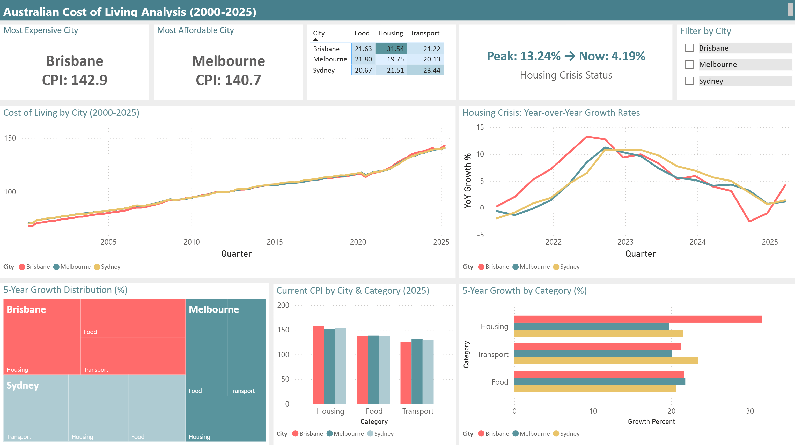

# 🏠 Australian Cost of Living Analysis (2000-2025)

## Overview
An end-to-end data analysis project examining the cost of living trends across Sydney, Melbourne, and Brisbane over 25 years (2000-2025). The analysis focuses on Housing, Food, and Transport categories using Australian Bureau of Statistics (ABS) Consumer Price Index (CPI) data.

---

## Key Findings
- **Brisbane** overtook Sydney as Australia's most expensive city around 2022
- **Brisbane Housing** recorded the highest 5-year growth at **31.54%** (2020-2025)
- The housing crisis peaked at **13.24% YoY growth** in 2022, now cooling to **4.19%**
- Housing costs grew significantly faster than Food and Transport across all cities

---

## Tools Used
| Tool | Purpose |
|------|---------|
| **SQL Server (SSMS)** | Data cleaning, transformation and analysis |
| **Power Query** | Data transformation and unpivoting |
| **Power BI Desktop** | Data modeling, DAX measures and visualization |

---

## Data Source
**Australian Bureau of Statistics (ABS)** - Consumer Price Index data
- Covers: Sydney, Melbourne, Brisbane
- Categories: Housing, Food, Transport, All Groups
- Period: March 2000 to March 2025
- Frequency: Quarterly

---

## Project Structure
australian-cost-of-living-analysis/
│
├── Main.sql                          # Data cleaning and exploratory analysis queries
├── PowerBI_Import_Queries.sql        # SQL queries used for Power BI data import
└── Australian_Cost_of_Living.pbix    # Power BI dashboard file

---

## SQL Analysis
### Main.sql covers:
- Data cleaning (removing metadata rows, renaming columns, fixing data types)
- Current cost of living comparison across cities
- Category differences (Housing vs Food vs Transport)
- 5-year growth rate calculations
- Year-over-year percentage changes using window functions (LAG)

### PowerBI_Import_Queries.sql covers:
- **Query 1:** Main CPI dataset (2000-2025) for timeline and comparison charts
- **Query 2:** Year-over-year growth rates (2020-2025) for crisis analysis
- **Query 3:** 5-year growth summary using UNION ALL for heatmap visualization

---

## Power BI Dashboard
The dashboard tells the complete story in 3 rows:

### Row 1: Current State
- Most Expensive City card (Brisbane - CPI: 142.9)
- Most Affordable City card (Melbourne - CPI: 140.7)
- 5-Year Growth Matrix (City × Category heatmap)
- Housing Crisis Status card (Peak → Now)
- City filter slicer

### Row 2: Historical Context
- 25-year Cost of Living Timeline (all 3 cities)
- Housing Crisis: Year-over-Year Growth Rates (2020-2025)

### Row 3: Deep Analysis
- 5-Year Growth Distribution Treemap
- Current CPI by City & Category (2025)
- 5-Year Growth by Category comparison

---

## Data Model
Built a proper star schema in Power BI with:
- **Fact tables:** CPI_Data_Long, YoY_Growth_Long, Growth_Matrix, CPI_Current
- **Dimension tables:** City_Dim, Category_Dim
- **Relationships:** One-to-many from dimension tables to fact tables

---

## Key SQL Concepts Used
- CTEs (Common Table Expressions)
- Window Functions (LAG for YoY calculations)
- CROSS JOIN for time point comparisons
- UNION ALL for reshaping data
- Data type conversions and CAST
- Subqueries for dynamic date filtering

## Key Power BI Concepts Used
- Power Query data transformation (unpivoting wide to long format)
- DAX measures for dynamic KPI cards
- Conditional formatting (gradient heatmap)
- Data modeling with relationships
- Multiple chart types (line, bar, treemap, matrix, cards)
- Interactive slicers with cross-filtering

---

## How to Use
1. Clone or download this repository
2. Run Main.sql in SQL Server Management Studio against your CPI database
3. Run PowerBI_Import_Queries.sql to verify import queries
4. Open Australian_Cost_of_Living.pbix in Power BI Desktop
5. Update the data source connection to your local SQL Server

---

## Author
Veronica Gomes
- Data Analytics Portfolio Project
- Tools: SQL Server, Power Query, Power BI
